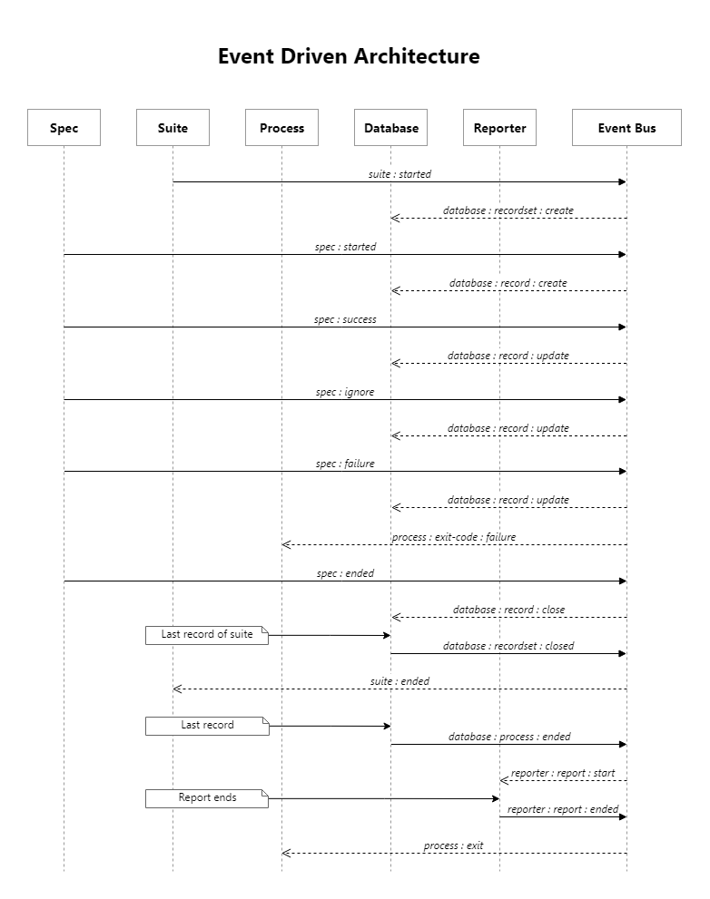

# Developer documentation

This document is meant to clarify architecture and choices made to ease
the life of future contributors. It's not in the documentation website
as it's something more developer oriented than user oriented.

### Architecture

Starting from the last release, Titef migrated to an event driven
architecture.

All the events go through central event broker which is called `Event
Bus` and all the other parties are both Publisher and Subscriber.

Each of those Event Processors can be thought as Node's
[EventEmitter](https://nodejs.org/api/events.html#events_class_eventemitter).
Actually, most of them _are_ so: the only exceptions are `Spec` and 
`Suite` as they are exposing instances of `EventEmitter` without being 
so. 

The reason why these are not classes is simple: we wanted to have a 
shared context between suite and spec and methods in classes cannot have
a context which is not the class itself. We could have created `static` 
methods or put everything in the same class, but the current 
implementation sounded like the cleanest.

### The chart


Each arrow, excluding the ones coming out from the "sticky notes",
represents an event whose name is the label of such arrow.

_Dashed arrows_ are events generated as "response" to other events.

_Sticky notes_ represent conditions or, more in general, comments.

### Event processors

The following sections will explain what each of the Event Processor is
doing and, if it's not obvious, why do it exists.

#### Database

[Database](./database.js) is an EventEmitter which is responsible for 
managing an in memory database whose records contain all the information 
we need to print reports.

In memory database sounds cumbersome... It's actually a big POJO with
the following structure:

```
{
   [suite name]: {
       meta {
          processed,  // specs processed in the suite
          path,       // suite property path
          silent,     // whether or not print this suite 
       },
       [spec name]: {
           result,    // SUCCESS, FAILED, PENDING, IGNORED
           payload    // error (if any)
       }
}
```

As you can see, for each suite we have multiple records (eventually 
other suites). How would you call a set of record set? :smiley:

#### Process Manager

[Another event emitter](./process-manager.js) whose aim is to handle
the current process.

Why do we need this?
Basically we just need to exit the current process with exit code
non-zero if any assertion fails or any error occurs. Also, we need to
exit the process only _after_ the report is over.

Therefore we need to listen to the `reporter:report:ended` event and
when this occurs, we close the process with the suitable exit code.

#### Reporter

The [reporter](./reporter), as the name suggests, is what is supposed 
to report test results.

As you might have noticed, it has a different structure than the other
components. Reason being is that we want to allow, in future versions,
pluggable reporter to allow reporting in HTML, JUnit style, Markdown and
what not.

Reporter needs to read records from `Database`. Such records are passed
as event payload by `Database` when the processing of all the specs is
done.

#### Spec

[This](./spec.js) Event Processor emits all the events related to a 
specification status.

This has two methods `spec` and `xspec` that are publicly exposed and
documented [here](https://shikaan.github.io/titef).

#### Suite

[This](./suite.js) Event Processor emits all the events related to a 
suite status.

This exposes the method `suite` that is documented
[here](https://shikaan.github.io/titef).

### Conventions

The only ongoing convention is about _event naming_.

#### Event Naming

Each event should be in the following form

```
${namespace}:${object}:${verb}
```

The **namespace** is usually the name of the Event Processor dealing
with such event.

The **object** has the meaning we use in English grammar, it's like
"direct object".

The **verb** should be the action being executed. It can be in *base*
form if you want to use the event to _trigger_ an action, it should be
in *past participle* form if the event is meant to _notify_ something
that has already happened.

> **Example**
>
> Suppose I want my dog Snoopy to eat, the event should be
> `dog:snoopy:eat`.
>
> The notification for when it's done should be `dog:snoopy:eaten`.
